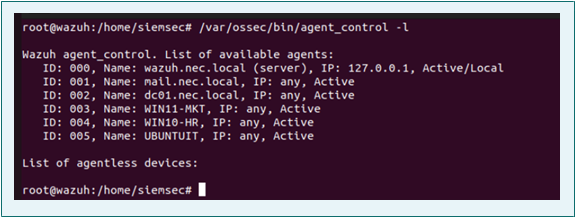
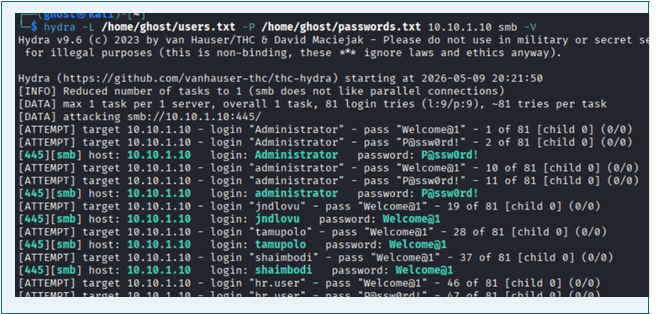
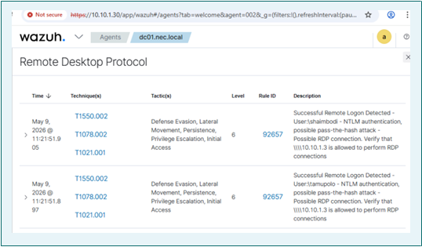
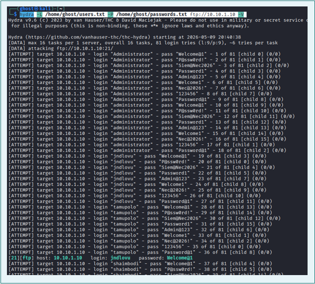
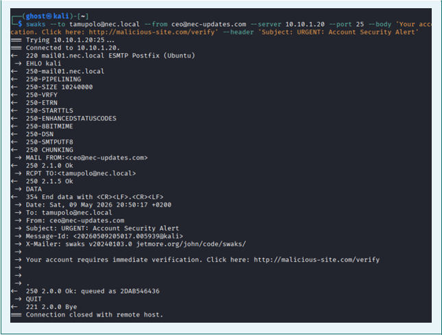
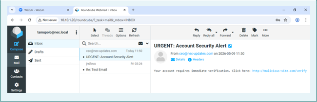
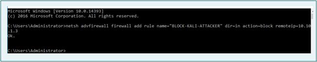
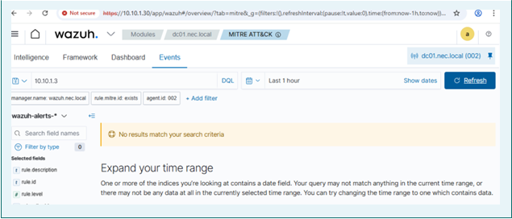

# 🛡️ Wazuh SIEM — Proof of Concept Lab

> **Simulating, detecting, and responding to real-world cyber attacks using an open-source SIEM in a virtualised corporate network.**

---

## Overview

This project documents a full Security Information and Event Management (SIEM) Proof of Concept (PoC) conducted against a simulated corporate network built to represent a small e-commerce company (NEC — Namibia E-commerce Company Ltd Pty).

The goal was to prove that **Wazuh** — a free, open-source SIEM platform — can detect real attack patterns and support structured incident response in an environment that mirrors what you'd find in a real business.

The project covered the full lifecycle:
- Designing and deploying a multi-machine lab network
- Installing and configuring the SIEM with agents on every endpoint
- Simulating three different attacks from a Kali Linux attacker machine
- Detecting every attack in real time
- Executing a structured incident response

---

## Lab Environment

The network was built using **VMware Workstation Pro**, with seven virtual machines on a Host-Only network (`10.10.1.0/24`).

| Hostname | Role | IP | OS |
|---|---|---|---|
| DC01.nec.local | Active Directory / DNS / FTP | 10.10.1.10 | Windows Server 2016 |
| MAIL01.nec.local | Email Server (Postfix/Dovecot) | 10.10.1.20 | Ubuntu 22.04 LTS |
| WAZUH.nec.local | Wazuh SIEM (All-in-One) | 10.10.1.30 | Ubuntu 22.04 LTS |
| WIN10-HR | Client — HR Department | 10.10.1.40 | Windows 10 |
| WIN11-MKT | Client — Marketing Department | 10.10.1.41 | Windows 11 |
| UBUNTUIT | Client — IT Department | 10.10.1.42 | Ubuntu 22.04 LTS |
| KALI | Attacker Machine | 10.10.1.3 | Kali Linux |



The Active Directory domain (`nec.local`) had three departments — HR, IT, and Marketing — each with their own Organisational Units and domain user accounts.

---

## SIEM Setup

**Wazuh v4.7.5** was deployed as an all-in-one installation on the dedicated Ubuntu server. It includes three components working together:

- **Wazuh Manager** — collects events from agents, runs detection rules, and generates alerts
- **Wazuh Indexer** — stores all events (OpenSearch-based)
- **Wazuh Dashboard** — web interface for visualising and investigating alerts (HTTPS, port 443)

### Agent Deployment

Wazuh agents were installed on **all five endpoints** and connected to the Manager on port 1514 (TCP). Agent version was pinned to `4.7.5` across all Linux machines to ensure compatibility — a version mismatch during deployment caused initial registration failures (see [Challenges](#challenges)).

### Log Collection

**Windows endpoints (DC01, WIN10-HR, WIN11-MKT):**
- Microsoft Sysmon installed using the [SwiftOnSecurity](https://github.com/SwiftOnSecurity/sysmon-config) ruleset
- Collects process creation, network connections, and file events beyond standard Windows Event Logs
- Wazuh agent configured to pull from `Microsoft-Windows-Sysmon/Operational` plus Security, System, and Application channels

**Linux endpoints (MAIL01, UBUNTUIT):**
- `auditd` installed with custom rules to monitor `/etc/passwd`, `/etc/shadow`, `/etc/sudoers`
- Captures all executed commands via `execve` syscall
- Auth events collected from `/var/log/auth.log`

---

## Attack Simulations

### Attack 1 — Brute-Force on Active Directory (SMB)

**Tool:** Hydra  
**Target:** DC01 (10.10.1.10), port 445 (SMB)  
**What it simulates:** A threat actor trying to guess domain account credentials to gain initial access

```bash
hydra -L users.txt -P passwords.txt 10.10.1.10 smb -V
```

**Detection:** Wazuh fired Wazuh rule **60104** for repeated Windows audit failures. Windows Security Log recorded Event ID **4625** (failed logon) in rapid succession and Event ID **4740** (account lockout) once thresholds were hit. The volume and frequency of events made automated attack behaviour obvious.




---

### Attack 2 — Unauthorised FTP Access

**Tool:** Hydra  
**Target:** DC01 FTP service (10.10.1.10), port 21  
**What it simulates:** An attacker attempting to access sensitive files on the company FTP server

```bash
hydra -L users.txt -P passwords.txt ftp://10.10.1.10 -V
```

**Detection:** The Wazuh agent on DC01 was configured to collect IIS FTP logs. Repeated failed authentication events appeared in the Security Events dashboard with the attacker's IP (`10.10.1.3`) clearly identified. The density of sequential failures confirmed automated brute-forcing.

---



### Attack 3 — Phishing Email Simulation

**Tool:** swaks (Swiss Army Knife for SMTP)  
**Target:** MAIL01 (10.10.1.20), port 25  
**What it simulates:** An attacker sending a spoofed email to a corporate user to harvest credentials

```bash
swaks --to tamupolo@nec.local \
      --from ceo@nec-updates.com \
      --server 10.10.1.20 \
      --port 25 \
      --body 'Your account requires immediate verification. Click here: http://malicious-site.com/verify' \
      --header 'Subject: URGENT: Account Security Alert'
```

**Detection:** The email was delivered and logged in Postfix's `/var/log/mail.log`. The log captured the spoofed sender domain (`nec-updates.com`), originating IP (`10.10.1.3`), and recipient mailbox — providing clear forensic evidence. The Wazuh agent forwarded these entries to the manager in real time.




> **Note:** Passive Nmap reconnaissance (pre-attack) did **not** trigger SIEM alerts — Wazuh relies on endpoint logs, not network traffic inspection. This highlights the value of pairing Wazuh with a network-based IDS like Suricata for full coverage.

---

## Incident Response

The response followed the **NIST SP 800-61** four-phase lifecycle:

### Phase 1 — Identification
Wazuh's Security Events dashboard was used to review alerts, identify the attacker IP, the targeted services, and reconstruct a full attack timeline from correlated logs.

### Phase 2 — Containment
The attacker IP (`10.10.1.3`) was blocked at both targets:

```bash
# Windows (DC01)
netsh advfirewall firewall add rule name="BLOCK-KALI-ATTACKER" dir=in action=block remoteip=10.10.1.3

# Linux (MAIL01)
ufw deny from 10.10.1.3 to any
```



### Phase 3 — Eradication
- Locked-out domain accounts were re-enabled and passwords reset
- Account lockout policy hardened (5 attempts → 30-minute lockout)
- FTP access restricted to authorised IP ranges via IIS IPv4 restrictions
- SASL and relay misconfigurations in Postfix resolved

### Phase 4 — Recovery
Services were verified operational and the SIEM was monitored to confirm no further attack activity from the blocked IP — which was confirmed.

---



## Key Findings

| Ref | Severity | Finding |
|---|---|---|
| F-01 | 🔴 CRITICAL | SMB exposed on DC01 with no rate limiting — allows unconstrained brute-force |
| F-02 | 🟠 HIGH | FTP uses Basic Auth over unencrypted port 21 — credentials sent in cleartext |
| F-03 | 🟠 HIGH | SMTP server accepted unauthenticated inbound email from external domains |
| F-04 | 🟡 MEDIUM | No account lockout policy — unlimited failed logon attempts permitted |
| F-05 | 🔵 INFO | Wazuh detected all three attack types in real time |
| F-06 | 🔵 INFO | All five agents stayed connected and active throughout the engagement |

---

## Recommendations

**Immediate (0–30 days)**
- Enforce account lockout policy via Group Policy (5 attempts, 30-min lockout)
- Replace FTP with SFTP to encrypt credentials in transit
- Configure Postfix to reject unauthenticated relay and implement SPF/DKIM
- Enable MFA for all administrator accounts
- Restrict SMB (port 445) to authorised hosts; disable SMBv1

**Medium-term (30–90 days)**
- Enable Wazuh Active Response to auto-block brute-force source IPs
- Develop custom Wazuh decoders for Postfix mail logs
- Deploy an email gateway with phishing detection upstream of MAIL01
- Implement network segmentation to isolate DC01

**Long-term (90+ days)**
- Integrate threat intelligence feeds (AlienVault OTX, AbuseIPDB) into Wazuh
- Establish a formal SOC alert triage and escalation procedure
- Schedule regular penetration tests against production systems
- Deliver mandatory security awareness training to all staff

---

## Challenges

Real lab work is never clean. Here's what broke and how it was fixed:

**1. SMTP port and authentication mismatch**  
Roundcube was configured for port 587 with SASL auth, but Postfix hadn't been set up for SASL via Dovecot. Fixed by switching to port 25 (no auth required for same-host delivery) and correcting a typo in `smtpd_relay_restrictions` — `permit-mynetworks` (hyphen) instead of `permit_mynetworks` (underscore).

**2. Wazuh agent version mismatch**  
`apt` resolved to the latest agent version (4.14.5), which the Manager (4.7.5) rejected at registration. Fixed by explicitly pinning: `apt-get install wazuh-agent=4.7.5-1`.

**3. MANAGER_IP placeholder not replaced**  
Several agents retained the literal string `MANAGER_IP` in `ossec.conf` instead of the actual Manager IP, causing the agent service to fail on start. Fixed by manually editing `/var/ossec/etc/ossec.conf` on each affected machine.

**4. Dovecot SASL socket missing**  
Postfix was still configured with `smtpd_sasl_auth_enable = yes` after the SMTP fix, but the Dovecot auth socket hadn't been provisioned, causing a 451 reject on all outbound mail. Fixed by disabling SASL: `postconf -e 'smtpd_sasl_auth_enable = no'`.

---

## Tools & Technologies

`Wazuh v4.7.5` · `Sysmon (SwiftOnSecurity config)` · `auditd` · `Hydra` · `swaks` · `Nmap` · `Postfix` · `Dovecot` · `Roundcube` · `IIS FTP` · `Active Directory DS` · `VMware Workstation Pro` · `Kali Linux` · `Windows Server 2016` · `Ubuntu 22.04 LTS`

---

## References

- Wazuh Documentation v4.7 — https://documentation.wazuh.com
- NIST SP 800-61 Rev. 2 (Incident Response) — https://csrc.nist.gov/publications/detail/sp/800-61/rev-2/final
- SwiftOnSecurity Sysmon Config — https://github.com/SwiftOnSecurity/sysmon-config
- THC-Hydra — https://github.com/vanhauser-thc/thc-hydra
- Microsoft Sysmon Docs — https://docs.microsoft.com/en-us/sysinternals/downloads/sysmon

---

*This project was completed as part of the Applied Ethical Hacking (AEH811S) module at the Namibia University of Science and Technology (NUST), Faculty of Computing and Informatics.*
